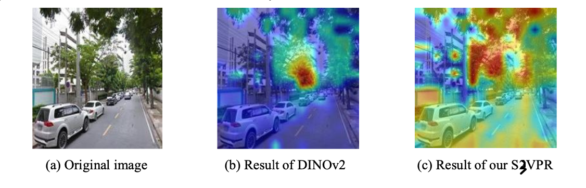

> We express the thanks to these authors: [gsv-cities](https://github.com/amaralibey/gsv-cities), [MixVPR](https://github.com/amaralibey/MixVPR), [SALAD](https://github.com/serizba/salad), [DINOv2](https://github.com/facebookresearch/dinov2), [CricaVPR](https://github.com/Lu-Feng/CricaVPR), [SENet](https://github.com/sungonce/SENet).

## Introduction

    
	
DINOv2 focuses on discriminative regions, such as trees; Based on the effect of DINOv2, S3VPR expands the range of discriminative regions.

    
    
Taken module, the core of S3VPR.

## Train

1. Install annoconda.
2. Configure the `s3vpr` runtime environment: `conda create --name s3vpr python=3.9`. Then, install the python package: `pip install -r requirement.txt`.
3. Download the dataset
* [GSV-Cities](https://github.com/amaralibey/gsv-cities.git)
* [Mapillary Street-level Sequences Dataset](https://github.com/mapillary/mapillary_sls)
* [Pitts30K/Pitts250K](https://data.ciirc.cvut.cz/public/projects/2015netVLAD/Pittsburgh250k/)
* [Tokyo24/7](https://data.ciirc.cvut.cz/public/projects/2015netVLAD/Tokyo247/)
4. Change the `dataloaders/train`, `dataloaders/val` python files related to the dataset path.
5. Clone `DINOv2`: `git Clone https://github.com/facebookresearch/dinov2.git` at the path of `S3VPR`.
6. In `pth`, download the training model: https://dl.fbaipublicfiles.com/dinov2/dinov2_vitb14/dinov2_vitb14_pretrain.pth.
7. Train the model using the `train.sh` command.

## Evaluate
1. Download the checkpoint from [Google Drive](https://drive.google.com/file/d/1MQ6QmsVKPivjXuSs9p1afi9peMtgc0is/view?usp=drive_link) to the path `pth`.
2. Run `python eval.py`.

## Citation

> Our paper, `S3VPR: Space Self-awareness under self-attention for Visual Place Recognition` is under review .....

